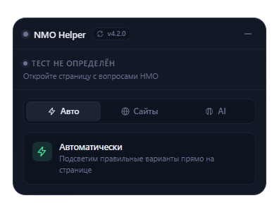
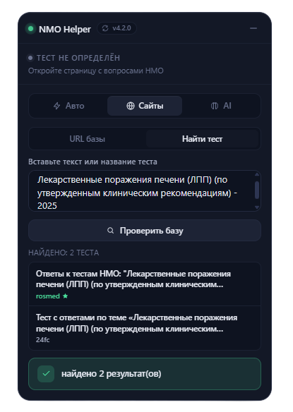

# NMO Helper Plugin v2.1.0

Расширение для браузера, которое поможет вам решить тесты (ИОМ'ы) на портале НМО — https://a.edu.rosminzdrav.ru
 
Прост в установке, работает из коробки.
 
Ответы берутся с сайтов `rosmedicinfo.ru` и `24forcare.com`, а также с помощью AI.
 

## Возможности

- Автоподсветка правильных ответов при переходе между вопросами
- **Авто-поиск** — автоматически находит тему теста и ищет ответы на `rosmedicinfo.ru` и `24forcare.com`
- **AI-режим** — решает тесты с помощью AI (GPT, Gemini, Claude) через ProxyAPI
- Ручной поиск ответов по названию теста сразу на двух сайтах
- Выбор модели AI с уровнями: low / medium / high / ultra
- Плавающая панель с перетаскиванием и сворачиванием
- Сохранение позиции панели, состояния и URL между сессиями
- Умное сопоставление ответов: нормализация тире, смешанных кириллица/латиница, нечёткий поиск
- Кеширование ответов при навигации вперёд/назад
- Статусы в реальном времени: найдено / не найдено / ошибка
- Обход CORS без дополнительных плагинов

## Требования

- **Google Chrome** (или Chromium-based браузер: Edge, Brave, Opera, Яндекс Браузер)
- **Mozilla Firefox**

## Установка

### Google Chrome (и другие Chromium-браузеры)

1. Скачай [`nmo-helper-main.zip`](https://github.com/lKolabrodl/nmo-helper/releases/download/v2.1.0/nmo-helper-main.zip)
2. Разархивируйте содержимое
3. Открой `chrome://extensions/` в адресной строке
4. Включи переключатель **«Режим разработчика»** в правом верхнем углу
5. Нажми **«Загрузить распакованное расширение»**
6. Выбери папку `nmo-helper-plugin`

### Mozilla Firefox

1. Скачай файл [`nmo-helper-firefox.xpi`](https://github.com/lKolabrodl/nmo-helper/releases/download/v2.1.0/firefox_nmo_helper.xpi)
2. Открой Firefox и перетащи файл `.xpi` в окно браузера, или открой `about:addons` → нажми шестерёнку ⚙ → **«Установить дополнение из файла»**
3. Подтверди установку

## Использование

1. Открой страницу тестирования НМО
2. В правом верхнем углу появится панель **NMO Helper**

### Авто-поиск rosmed & 24forcare

При включённой галочке **«Авто-поиск rosmed & 24forcare»** плагин сам определяет тему теста, ищет ответы на обоих сайтах и подсвечивает правильные варианты. Никаких действий от вас не требуется — просто включите и проходите тест.

- Приоритет: сначала ищет на **rosmedicinfo.ru**, если не нашёл — на **24forcare.com**
- Если один из сайтов недоступен — работает с другим
- Ответы кешируются — при навигации назад/вперёд повторных запросов нет

### Поиск вручную

При отключённых галочках вы можете искать ответы вручную.
 
Полезно, чтобы заранее узнать, есть ли решение, не заходя в сам тест.

1. Воспользуйтесь поиском — введите название теста
2. Выберите источник из результатов (**rosmed** / **24forcare**), или вставьте ссылку в поле URL
3. Нажмите **▶ Запуск**

### Решать с помощью AI

AI-режим позволяет решать тесты с помощью нейросетей. Поддерживаются модели OpenAI (GPT), Google Gemini и Anthropic Claude.

> К сожалению, у пользователей из России нет возможности пользоваться бесплатными API нейросетей (Google Gemini, OpenAI и др. заблокированы по региону). Поэтому для работы AI-режима используется сервис [proxyapi.ru](https://proxyapi.ru) — российский прокси к популярным AI-моделям с оплатой в рублях и без VPN.

> **Важно:** после регистрации на proxyapi.ru необходимо пополнить баланс на минимальную сумму. Без пополнения API-ключ не будет работать.
>
> Если вы потеряете API-ключ — не переживайте, его можно удалить и создать новый в любой момент на [console.proxyapi.ru/keys](https://console.proxyapi.ru/keys).

**Настройка:**

1. Зарегистрируйтесь на [proxyapi.ru](https://proxyapi.ru) и **пополните баланс** (минимальная сумма)
2. Получите API-ключ на [console.proxyapi.ru/keys](https://console.proxyapi.ru/keys)
3. Включите галочку **«Решать с помощью AI»**
4. Вставьте ключ в поле **«API-ключ ProxyAPI»**
5. Выберите модель — рекомендованные отмечены звёздочкой ★

**Как это работает:**

- Плагин парсит вопрос и варианты ответа со страницы теста
- Отправляет их в выбранную AI-модель вместе с темой теста
- AI возвращает номера правильных вариантов, плагин подсвечивает их
- Ответы кешируются — при навигации назад/вперёд повторных запросов нет

**Выбор модели:**

| Уровень | Модели | Описание |
|---------|--------|----------|
| low | gpt-4o-mini, gemini-2.0-flash, claude-haiku-4.5 | Быстрые и дешёвые, но менее точные |
| medium | gpt-4.1-mini ★, gemini-2.5-flash ★ | Баланс цена/качество |
| high | o3-mini ★, o4-mini ★, claude-sonnet-4.6 | Высокая точность |
| ultra | claude-opus-4.6 ★, gemini-3.1-pro | Максимальная точность, дороже |

> ★ — рекомендованные модели (выделены зелёным в списке) — самый оптимальный вариант по соотношению цена/качество
>
> $$$ — дорогие модели, расходуют много токенов
>
> **Следите за балансом!** Некоторые модели (особенно ultra и отмеченные $$$) потребляют значительно больше токенов. Рекомендуем начинать с моделей, отмеченных ★.

> **Disclaimer:** на практике AI-модели решают медицинские тесты НМО довольно плохо — в среднем на оценку 3. Это связано с тем, что вопросы основаны на специфических клинических рекомендациях РФ, которые AI-модели знают недостаточно хорошо. Рекомендуем использовать AI-режим как вспомогательный инструмент, а основной упор делать на **авто-поиск** по сайтам с готовыми ответами.

### Статусы панели

| Статус | Цвет         | Значение |
|---|--------------|---|
| ищу тему... | 🟡 жёлтый    | авто-режим ищет тему теста на странице |
| ищу ответы... | 🟡 жёлтый    | идёт поиск и загрузка ответов с сайтов |
| загружаю ответы... | 🟡 жёлтый    | идёт загрузка страницы с ответами |
| думаю... | 🟡 жёлтый    | AI обрабатывает вопрос |
| работает | 🟢 зелёный   | скрипт активен и мониторит вопросы |
| найдено | 🟢 зелёный   | ответ найден и подсвечен |
| AI (кеш) | 🟢 зелёный   | ответ взят из кеша без повторного запроса |
| ответ не найден | 🟠 оранжевый | вопрос отсутствует в базе ответов |
| ответ не совпал с вариантами | 🟠 оранжевый | ответ найден, но не совпадает с вариантами |
| ошибка сети | 🔴 красный   | не удалось загрузить страницу с ответами |
| неверный API-ключ | 🔴 красный   | API-ключ невалиден или истёк |

## Безопасность

Расширение проверено на вирусы через VirusTotal:

## Поддержать проект

Если расширение оказалось полезным, можете поддержать разработку:

## Предыдущие версии

- [v1.4.2](https://github.com/lKolabrodl/nmo-helper/tree/v1.4.2) — только поиск по сайтам, без AI-режима и авто-поиска ([скачать .zip](https://github.com/lKolabrodl/nmo-helper/archive/refs/tags/v1.4.2.zip))

## Лицензия

MIT
