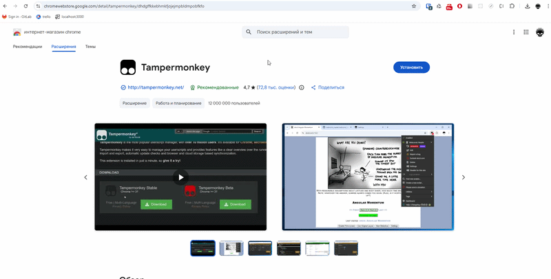
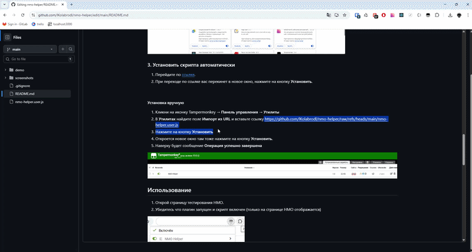
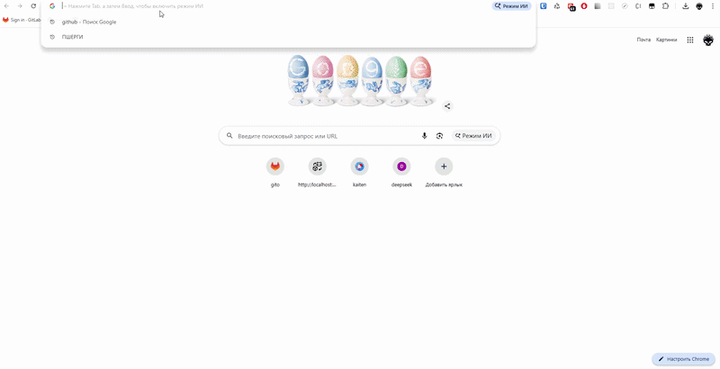
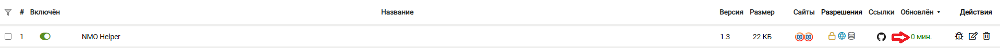

# NMO Helper v1.4.2

Расширение для браузера, которое поможет вам решить тесты (ИОМ'ы) на портале НМО — https://a.edu.rosminzdrav.ru
 
Прост в установке, работает из коробки, поддерживает автообновление.
 
Ответы берутся с сайтов `rosmedicinfo.ru` и `24forcare.com`.

## Возможности

- Автоподсветка правильных ответов при переходе между вопросами
- Автопоиск ответов по названию теста сразу на двух сайтах
- Источники: `rosmedicinfo.ru` и `24forcare.com` — определяются автоматически по URL
- Плавающая панель с перетаскиванием и сворачиванием
- Умное сопоставление ответов: нормализация тире, смешанных кириллица/латиница, нечёткий поиск
- Статусы в реальном времени: найдено / не найдено / ошибка
- Обход CORS без дополнительных плагинов
- Автообновление скрипта через Tampermonkey

## Требования

- **Google Chrome** (или Chromium-based браузер: Edge, Brave, Opera, Яндекс Браузер)
- **Tampermonkey** — расширение для запуска юзерскриптов

## Установка

### 1. Установить Tampermonkey

Перейди в [Chrome Web Store](https://chromewebstore.google.com/detail/tampermonkey/dhdgffkkebhmkfjojejmpbldmpobfkfo) и установи расширение.

### 2. Включить режим разработчика

Tampermonkey требует включённый режим разработчика в Chrome для корректной работы:

1. Открой `chrome://extensions/` в адресной строке
2. Включи переключатель **«Режим разработчика»** в правом верхнем углу
3. На этой же странице, если прокрутить вниз, найдите **Tampermonkey** и нажми **«Сведения»**
4. Выберите **«Доступ к сайтам»** - **На всех сайтах**
5. Включи **«Разрешить пользовательские скрипты»** и **«Закрепить на панели инструментов»**
6. Перезапусти браузер

### 3. Установить скрипта автоматически
1. Перейдите по [ссылке](https://github.com/lKolabrodl/nmo-helper/raw/refs/heads/main/nmo-helper.user.js).
2. При переходе по ссылке вас перекинет в новое окно, нажмите на кнопку **Установить**.

#### Установка вручную (Если автоматически не установилось)
1. Кликни на иконку Tampermonkey → **Панель управления** → **Утилиты**
2. В **Утилитах** найдите поле **Импорт из URL** и вставьте ссылку https://github.com/lKolabrodl/nmo-helper/raw/refs/heads/main/nmo-helper.user.js
3. Нажмите на кнопку **Установить**
4. Откроется новое окно там тоже нажмите на кнопку **Установить**.
5. Наверху будет сообщение **Операция успешно завершена**

## Использование

1. Открой страницу тестирования НМО.
2. Убедитесь что плагин запущен и скрипт включен (только на странице НМО отображается)

3. В правом верхнем углу появится панель **NMO Helper**
4. Воспользуйтесь автопоиском, введите туда название теста.

6. Нажми **▶ Запуск**

7. Если автопоиск ничего не нашёл, попробуйте сами найти ответы сайте: `rosmedicinfo.ru` или `24forcare.com`.
8. Вставь URL страницу с ответами ответами в поле ввода: **URL страницы с ответами**
9. Нажми **▶ Запуск**

Скрипт будет автоматически подсвечивать правильные ответы красным цветом при переходе между вопросами.

### Статусы панели

| Статус | Цвет         | Значение |
|---|--------------|---|
| загружаю ответы... | 🟡 жёлтый    | идёт загрузка страницы с ответами |
| работает | 🟢 зелёный   | скрипт активен и мониторит вопросы |
| найдено | 🟢 зелёный   | ответ найден и подсвечен |
| ответ не найден | 🟠 оранжевый | вопрос отсутствует в базе ответов |
| ответ не совпал с вариантами | 🟠 оранжевый | ответ найден, но не совпадает с вариантами |
| ошибка сети | 🔴 красный   | не удалось загрузить страницу с ответами |

## Автообновление

Скрипт поддерживает автоматическое обновление через **Tampermonkey**. 
В настройках можно поставить **Интервал обновления**: **Всегда**
 
При выходе новой версии Tampermonkey сам обнаружит обновление и предложит установить его.

Также можно обновить вручную: Tampermonkey → Панель управления → Установленные скрипты.
Нажать в таблице на дату

## Лицензия

MIT
