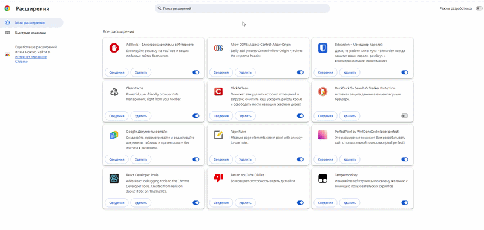
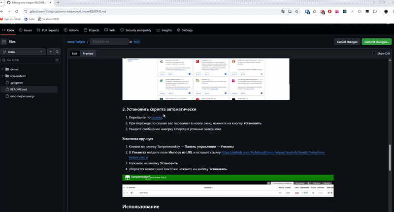

# NMO Helper Plugin v1.4.2

Расширение для браузера, которое поможет вам решить тесты (ИОМ'ы) на портале НМО — https://a.edu.rosminzdrav.ru
 
Прост в установке, работает из коробки.
 
Ответы берутся с сайтов `rosmedicinfo.ru` и `24forcare.com`.
 

## Возможности

- Автоподсветка правильных ответов при переходе между вопросами
- Автопоиск ответов по названию теста сразу на двух сайтах
- Источники: `rosmedicinfo.ru` и `24forcare.com` — определяются автоматически по URL
- Плавающая панель с перетаскиванием и сворачиванием
- Сохранение позиции панели, состояния и URL между сессиями
- Умное сопоставление ответов: нормализация тире, смешанных кириллица/латиница, нечёткий поиск
- Статусы в реальном времени: найдено / не найдено / ошибка
- Обход CORS без дополнительных плагинов

## Требования

- **Google Chrome** (или Chromium-based браузер: Edge, Brave, Opera, Яндекс Браузер)

## Установка

1. Скачай или клонируй этот репозиторий
2. Разархивируйте содержимое

3. Открой `chrome://extensions/` в адресной строке
4. Включи переключатель **«Режим разработчика»** в правом верхнем углу
5. Нажми **«Загрузить распакованное расширение»**
6. Выбери папку `nmo-helper-plugin`

## Использование

1. Открой страницу тестирования НМО
2. В правом верхнем углу появится панель **NMO Helper**

3. Воспользуйтесь автопоиском, введите туда название теста
4. Нажми **▶ Запуск**

5. Если автопоиск ничего не нашёл, попробуйте сами найти ответы на сайте: `rosmedicinfo.ru` или `24forcare.com`
6. Вставь URL страницы с ответами в поле ввода: **URL страницы с ответами**
7. Нажми **▶ Запуск**

Скрипт будет автоматически подсвечивать правильные ответы при переходе между вопросами.

### Статусы панели

| Статус | Цвет         | Значение |
|---|--------------|---|
| загружаю ответы... | 🟡 жёлтый    | идёт загрузка страницы с ответами |
| работает | 🟢 зелёный   | скрипт активен и мониторит вопросы |
| найдено | 🟢 зелёный   | ответ найден и подсвечен |
| ответ не найден | 🟠 оранжевый | вопрос отсутствует в базе ответов |
| ответ не совпал с вариантами | 🟠 оранжевый | ответ найден, но не совпадает с вариантами |
| ошибка сети | 🔴 красный   | не удалось загрузить страницу с ответами |

## Безопасность

Расширение проверено на вирусы через VirusTotal:

## Поддержать проект

Если расширение оказалось полезным, можете поддержать разработку:

## Лицензия

MIT
