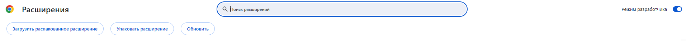
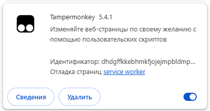
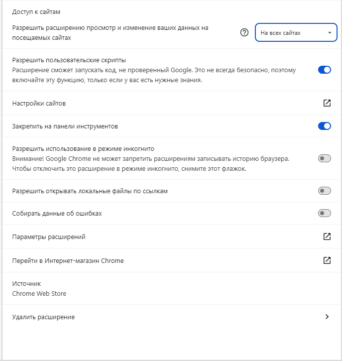
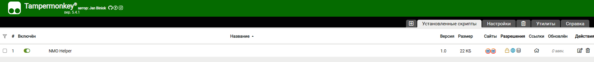
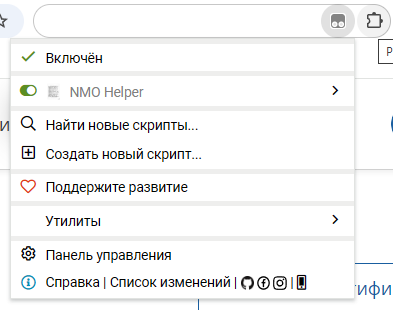
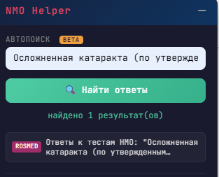

# NMO Helper v1.4

Tampermonkey-скрипт для автоподсветки правильных ответов на тестах НМО. Поддержка нескольких источников, плавающая панель управления, сохранение настроек между сессиями.

## Возможности

- Автоматическая подсветка правильных ответов красным цветом
- Плавающая панель с drag-перемещением и сворачиванием
- Два источника ответов: `rosmedicinfo.ru` и `24forcare.com` (определяется автоматически по URL)
- Сохранение URL между сессиями
- Нормализация тире, смешанных кириллица/латиница символов
- Статус поиска в реальном времени: найден / не найден / ошибка
- Обход CORS без дополнительных плагинов

## Требования

- **Google Chrome** (или Chromium-based браузер: Edge, Brave, Opera, Яндекс Браузер)
- **Tampermonkey** — расширение для запуска юзерскриптов

## Установка

### 1. Установить Tampermonkey

Перейди в [Chrome Web Store](https://chromewebstore.google.com/detail/tampermonkey/dhdgffkkebhmkfjojejmpbldmpobfkfo) и установи расширение.

### 2. Включить режим разработчика

Tampermonkey требует включённый режим разработчика в Chrome для корректной работы:

1. Открой `chrome://extensions/` в адресной строке
2. Включи переключатель **«Режим разработчика»** в правом верхнем углу

3. На этой же странице, если прокрутить вниз, найдите **Tampermonkey** и нажми **«Сведения»**

4. Выберите **«Доступ к сайтам»** - **На всех сайтах**
5. Включи **«Разрешить пользовательские скрипты»** и **«Закрепить на панели инструментов»**

6. Перезапусти браузер

### 3. Установить скрипт
1. Кликни на иконку Tampermonkey → **Создать новый скрипт**
2. Удали всё содержимое и вставь код из `nmo-helper.user.js`
3. Нажми `Ctrl + S` для сохранения

## Использование

1. Открой страницу тестирования НМО.
2. Убедитесь что плагин запущен и скрипт включен (только на странице НМО отображается)

3. В правом верхнем углу появится панель **NMO Helper**
4. Воспользуйтесь автопоиском, введите туда название теста. **(BETA)**
5. В выпадающем списке кликните по варианту **ROSMED** или **24forcare**

6. Нажми **▶ Запуск**

7. Если автопоиск ничего не нашёл, попробуйте сами найти ответы сайте: `rosmedicinfo.ru` или `24forcare.com`.
8. Вставь URL страницу с ответами ответами в поле ввода: **URL страницы с ответами**
9. Нажми **▶ Запуск**

Скрипт будет автоматически подсвечивать правильные ответы красным цветом при переходе между вопросами.

### Статусы панели

| Статус | Цвет         | Значение |
|---|--------------|---|
| загружаю ответы... | 🟡 жёлтый    | идёт загрузка страницы с ответами |
| работает | 🟢 зелёный   | скрипт активен и мониторит вопросы |
| найдено | 🟢 зелёный   | ответ найден и подсвечен |
| ответ не найден | 🟠 оранжевый | вопрос отсутствует в базе ответов |
| ответ не совпал с вариантами | 🟠 оранжевый | ответ найден, но не совпадает с вариантами |
| ошибка сети | 🔴 красный   | не удалось загрузить страницу с ответами |

## Поддерживаемые источники

- **rosmedicinfo.ru** — поддерживает два типа разметки (h3 + span с подсветкой, p.MsoNormal с жирным текстом и знаком `+`)
- **24forcare.com** — разметка h3 + strong

## Автообновление

Скрипт поддерживает автоматическое обновление через **Tampermonkey**. 
В настройках можно поставить **Интервал обновления**: **Всегда**
 
При выходе новой версии Tampermonkey сам обнаружит обновление и предложит установить его.

Также можно обновить вручную: Tampermonkey → Панель управления → Установленные скрипты. 
Нажать в таблице на дату 

## Лицензия

MIT
