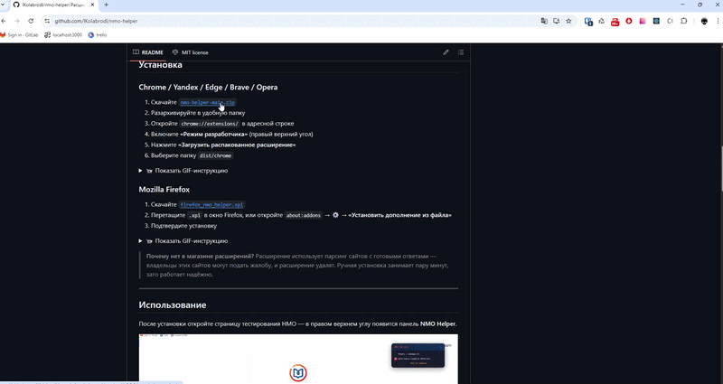
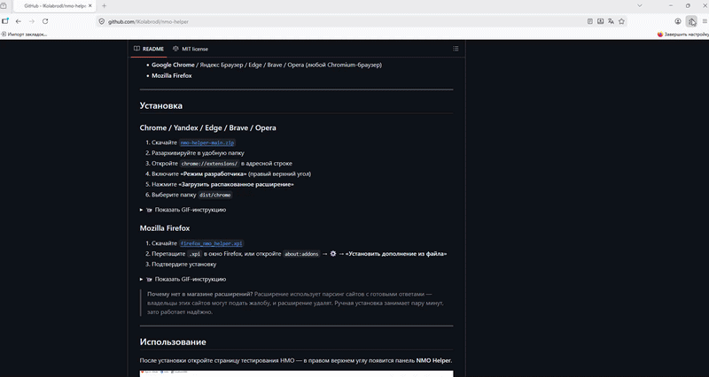

# NMO Helper v3.1.4

> Умный помощник в прохождении тестов НМО на портале [edu.rosminzdrav.ru](https://a.edu.rosminzdrav.ru) — бесплатное расширение для браузера с открытым исходным кодом.

Авто-поиск ответов на `rosmedicinfo.ru` и `24forcare.com`, AI-режим (GPT, Gemini, Claude, DeepSeek), работает из коробки.

[](https://addons.mozilla.org/ru/firefox/addon/nmo-helper/)
[](https://github.com/lKolabrodl/nmo-helper/releases)
[](https://github.com/lKolabrodl/nmo-helper)
[](https://github.com/lKolabrodl/nmo-helper/blob/main/LICENSE)
[](https://www.virustotal.com/gui/file/9da2c493686713029dd7339ad49647343599f0399c38108e73e81abb421b2a4f?nocache=1)

🌐 **Сайт:** [nmo-helper.ru](https://nmo-helper.ru)<br>
📖 **Инструкция:** [nmo-helper.ru/instruction](https://nmo-helper.ru/instruction)<br>
💬 **Обратная связь:** [nmo-helper.ru/feedback](https://nmo-helper.ru/feedback)

---

## Возможности

| | Функция | Описание |
|---|---|---|
| 🔍 | **Авто-поиск** | Автоматически находит тему теста и ищет ответы на двух сайтах |
| 🤖 | **AI-режим** | Решает тесты с помощью GPT, Gemini, Claude, DeepSeek через ProxyAPI или свой endpoint |
| 🔎 | **Ручной поиск** | Поиск ответов по названию теста на `rosmedicinfo.ru` и `24forcare.com` |
| ✨ | **Автоподсветка** | Правильные ответы подсвечиваются при переходе между вопросами |
| 💾 | **Кеширование** | Ответы кешируются — при навигации назад/вперёд повторных запросов нет |
| 🎯 | **Умное сопоставление** | Нормализация тире, смешанных кириллица/латиница, нечёткий поиск |
| 📌 | **Плавающая панель** | Перетаскивание, сворачивание, сохранение позиции между сессиями |
| 🌐 | **Обход CORS** | Работает без дополнительных плагинов |

## Требования

- **Google Chrome** / Яндекс Браузер / Edge / Brave / Opera (любой Chromium-браузер)
- **Mozilla Firefox**

---

## Установка

### Chrome / Yandex / Edge / Brave / Opera

1. Скачайте [`nmo-helper-chrome-3.1.4.zip`](https://github.com/lKolabrodl/nmo-helper/releases/download/v3.1.4/nmo-helper-chrome-3.1.4.zip)
2. Разархивируйте в удобную папку
3. Откройте `chrome://extensions/` в адресной строке
4. Включите **«Режим разработчика»** (правый верхний угол)
5. Нажмите **«Загрузить распакованное расширение»**
6. Выберите папку `nmo-helper-chrome-3.1.4`

<details>
<summary>📹 Показать GIF-инструкцию</summary>


</details>

### Mozilla Firefox

**Способ 1 (рекомендуется) — из Firefox Add-ons:**

Откройте страницу расширения в [Firefox Add-ons](https://addons.mozilla.org/ru/firefox/addon/nmo-helper/) и нажмите **«Добавить в Firefox»**. Расширение проверено и подписано Mozilla, обновляется автоматически.

**Способ 2 — прямая установка `.xpi`:**

1. Скачайте [`firefox_nmo_helper.xpi`](https://github.com/lKolabrodl/nmo-helper/releases/download/v3.0.0/firefox_nmo_helper.xpi)
2. Перетащите `.xpi` в окно Firefox, или откройте `about:addons` → ⚙ → **«Установить дополнение из файла»**
3. Подтвердите установку

<details>
<summary>📹 Показать GIF-инструкцию</summary>


</details>

> **Почему в Chrome нет магазинной версии?** Расширение использует парсинг сайтов с готовыми ответами — политика Chrome Web Store это запрещает, и расширение быстро удалят. Ручная установка через `chrome://extensions` занимает пару минут и работает надёжно.

---

## Использование

После установки откройте страницу тестирования НМО — в правом верхнем углу появится панель **NMO Helper**.


### Режимы работы

Переключение между режимами через таб-бар в панели: **Авто** / **Сайты** / **AI**.

### Авто

Панель сама определяет тему теста, ищет ответы и подсвечивает правильные варианты. Никаких действий не требуется.

- Сначала ищет на **rosmedicinfo.ru**, если не нашёл — на **24forcare.com**
- Если один сайт недоступен — работает с другим
- Ответы кешируются при навигации

### Сайты

1. Введите название теста в поиск
2. Выберите источник (**rosmed** / **24forcare**) или вставьте ссылку
3. Нажмите **Запуск**

### AI

Подключите нейросеть для решения тестов. Два варианта:

**ProxyAPI** (по умолчанию) — российский прокси с оплатой в рублях и без VPN:
1. Зарегистрируйтесь на [proxyapi.ru](https://proxyapi.ru) и пополните баланс
2. Получите API-ключ на [console.proxyapi.ru/keys](https://console.proxyapi.ru/keys)
3. Вставьте ключ и выберите модель
4. Нажмите **Запуск AI**

**Свой endpoint** — переключите свитч «Свой endpoint» и укажите:
- API Endpoint (OpenAI-совместимый, например `https://api.deepseek.com/v1/chat/completions`)
- API Token
- Название модели

### Модели (ProxyAPI)

| Уровень | Модели | Описание |
|---------|--------|----------|
| 🟢 low | gpt-4o-mini, gemini-2.0-flash, claude-haiku-4.5 | Быстрые и дешёвые |
| 🔵 medium | gpt-4.1-mini, gemini-2.5-flash | Баланс цена/качество |
| 🟡 high | o3-mini, o4-mini, claude-sonnet-4.6 | Высокая точность |
| 🟣 ultra | claude-opus-4.6, gemini-3.1-pro | Максимальная точность |

> **Disclaimer:** AI-модели решают медицинские тесты НМО в среднем на оценку 3 — вопросы основаны на специфических клинических рекомендациях РФ. Рекомендуем использовать AI как вспомогательный инструмент, а основной упор делать на **авто-поиск**.

---

## Структура проекта

```
src/
├── content.ts                  # Точка входа (content-script)
├── content.scss                # Общие стили панели
├── vars.scss                   # SCSS-переменные (цвета, размеры, шрифты)
├── App.tsx                     # Корневой React-компонент
├── Panel.tsx                   # Создание панели + drag
├── background.ts               # Service worker (CORS proxy)
├── types.ts                    # Типы и интерфейсы
├── popup.html / popup.css      # Popup при клике на иконку
│
├── components/
│   ├── Header/                 # Хедер с индикатором статуса
│   ├── TabBar/                 # Таб-бар (Авто / Сайты / AI)
│   ├── AutoSection/            # Авто-режим
│   ├── SitesSection/           # Ручной режим
│   ├── AiSection/              # AI-режим (ProxyAPI + свой endpoint)
│   ├── ModelDropdown/          # Выбор AI-модели
│   ├── BugReportButton/        # Кнопка отправки баг-репорта
│   ├── ErrorBoundary/          # Перехват ошибок рендера
│   └── Loader/                 # Headless-компоненты (загрузка, подсветка)
│
├── contexts/
│   ├── PanelUiContext.tsx       # UI-состояние (режим, свёрнутость)
│   ├── PanelStatusContext.tsx   # Статус per-mode
│   └── QuestionFinderContext.tsx # Отслеживание вопроса на странице
│
├── api/                         # Обёртки над браузерными API и сетью
│   ├── dom.ts                   # DOM-запросы с fallback-цепочками селекторов
│   ├── fetch.ts                 # Fetch через background (CORS bypass)
│   ├── storage.ts               # Обёртки chrome.storage
│   └── bug-report.ts            # Отправка баг-репортов на сервер
│
└── utils/                       # Чистые функции без сайд-эффектов
    ├── answer-cache.ts          # Кеш ответов (topic, question, variants) → answers
    ├── cases.ts                 # Диспатчер: extractCases + findAnswers (top-1 assignment)
    ├── extractors.ts            # Парсеры раскладок 24forcare / rosmedicinfo
    ├── matching.ts              # matchQuestion / variantScore / similarity
    ├── text.ts                  # Нормализация (тире, омоглифы, кавычки, пробелы)
    ├── html.ts                  # HTML-санитизация и парсинг
    ├── constants.ts             # Константы (селекторы, статусы, модели)
    └── index.ts                 # Реэкспорты для удобного импорта
```

### Сборка

```bash
npm install
npm run build       # Собрать dist/chrome, dist/firefox, dist/firefox-store
npm run dev         # Сборка в watch-режиме
npm test            # Запустить тесты (324 теста, покрытие utils + api + components)
```

---

## Безопасность

Расширение **не собирает данные**, **не требует регистрации**, **не отправляет аналитику** и **не подсовывает реферальные ссылки**. Но не верьте на слово — проверьте сами:

- Исходный код открыт на GitHub
- Проверено через [VirusTotal](https://www.virustotal.com/gui/file/9da2c493686713029dd7339ad49647343599f0399c38108e73e81abb421b2a4f?nocache=1)
- Подписано и опубликовано в [Firefox Add-ons](https://addons.mozilla.org/ru/firefox/addon/nmo-helper/)
- Политика конфиденциальности: [nmo-helper.ru/privacy](https://nmo-helper.ru/privacy)

## Поддержать проект

Проект создан на альтруистических началах — просто чтобы помочь. Если расширение оказалось полезным:

[](https://boosty.to/kolabrod/donate)

## Предыдущие версии

- [v3.1.1](https://github.com/lKolabrodl/nmo-helper/tree/v3.1.1) — фикс парсера rosmedicinfo для новых разметок + рефакторинг
- [v3.1.0](https://github.com/lKolabrodl/nmo-helper/tree/v3.1.0) — встроенный баг-репорт, ErrorBoundary, фикс cleanTopic
- [v3.0.1](https://github.com/lKolabrodl/nmo-helper/tree/v3.0.1) — публикация в Firefox Add-ons
- [v3.0.0](https://github.com/lKolabrodl/nmo-helper/tree/v3.0.0) — публичный релиз на React, приватный `.xpi` (`NMO Helper`)
- [v2.3.0](https://github.com/lKolabrodl/nmo-helper/tree/v2.3.0) — новые AI-модели, обновлённый парсинг
- [v2.2.2](https://github.com/lKolabrodl/nmo-helper/tree/v2.2.2) — миграция на TypeScript, тесты, JSDoc
- [v2.1.1](https://github.com/lKolabrodl/nmo-helper/tree/v2.1.1) — реструктуризация, esbuild сборка
- [v2.1.0](https://github.com/lKolabrodl/nmo-helper/tree/v2.1.0) — поддержка Firefox
- [v2.0.0](https://github.com/lKolabrodl/nmo-helper/tree/v2.0.0) — AI-режим, авто-поиск
- [v1.4.2](https://github.com/lKolabrodl/nmo-helper/tree/v1.4.2) — только поиск по сайтам, без AI

## Лицензия

MIT
