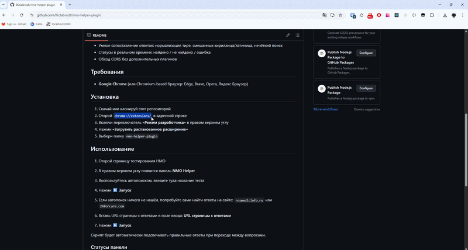
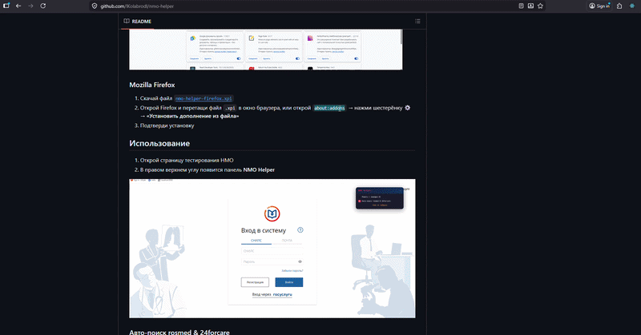
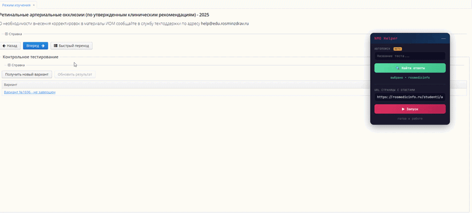
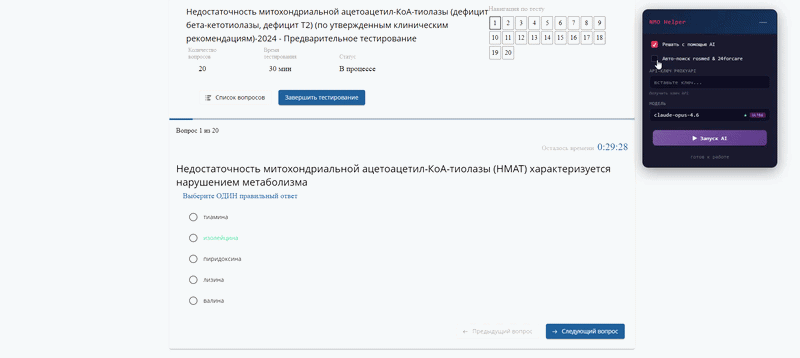

# NMO Helper v2.3.0

> Умный помощник в прохождении тестов НМО на портале [edu.rosminzdrav.ru](https://a.edu.rosminzdrav.ru) — бесплатное расширение для браузера с открытым исходным кодом.

Авто-поиск ответов на `rosmedicinfo.ru` и `24forcare.com`, AI-режим (GPT, Gemini, Claude), работает из коробки.

[](https://github.com/lKolabrodl/nmo-helper/releases)
[](https://github.com/lKolabrodl/nmo-helper)
[](https://github.com/lKolabrodl/nmo-helper/blob/main/LICENSE)
[](https://www.virustotal.com/gui/file/f88ca56932c00ededf4c29234c5f7ef0f3036439e714b294c5f0b68006064d85?nocache=1)

🌐 **Сайт:** [nmo-helper.ru](https://nmo-helper.ru)<br>
📖 **Инструкция:** [nmo-helper.ru/instruction](https://nmo-helper.ru/instruction)<br>
💬 **Обратная связь:** [nmo-helper.ru/feedback](https://nmo-helper.ru/feedback)

---

## Возможности

| | Функция | Описание |
|---|---|---|
| 🔍 | **Авто-поиск** | Автоматически находит тему теста и ищет ответы на двух сайтах |
| 🤖 | **AI-режим** | Решает тесты с помощью GPT, Gemini, Claude через ProxyAPI |
| 🔎 | **Ручной поиск** | Поиск ответов по названию теста на `rosmedicinfo.ru` и `24forcare.com` |
| ✨ | **Автоподсветка** | Правильные ответы подсвечиваются при переходе между вопросами |
| 💾 | **Кеширование** | Ответы кешируются — при навигации назад/вперёд повторных запросов нет |
| 🎯 | **Умное сопоставление** | Нормализация тире, смешанных кириллица/латиница, нечёткий поиск |
| 📌 | **Плавающая панель** | Перетаскивание, сворачивание, сохранение позиции между сессиями |
| 🌐 | **Обход CORS** | Работает без дополнительных плагинов |

## Требования

- **Google Chrome** / Яндекс Браузер / Edge / Brave / Opera (любой Chromium-браузер)
- **Mozilla Firefox**

---

## Установка

### Chrome / Yandex / Edge / Brave / Opera

1. Скачайте [`nmo-helper-main.zip`](https://github.com/lKolabrodl/nmo-helper/releases/download/v2.3.0/nmo-helper-main.zip)
2. Разархивируйте в удобную папку
3. Откройте `chrome://extensions/` в адресной строке
4. Включите **«Режим разработчика»** (правый верхний угол)
5. Нажмите **«Загрузить распакованное расширение»**
6. Выберите папку `dist/chrome`

<details>
<summary>📹 Показать GIF-инструкцию</summary>


</details>

### Mozilla Firefox

1. Скачайте [`firefox_nmo_helper.xpi`](https://github.com/lKolabrodl/nmo-helper/releases/download/v2.3.0/firefox_nmo_helper.xpi)
2. Перетащите `.xpi` в окно Firefox, или откройте `about:addons` → ⚙ → **«Установить дополнение из файла»**
3. Подтвердите установку

<details>
<summary>📹 Показать GIF-инструкцию</summary>


</details>

> **Почему нет в магазине расширений?** Расширение использует парсинг сайтов с готовыми ответами — владельцы этих сайтов могут подать жалобу, и расширение удалят. Ручная установка занимает пару минут, зато работает надёжно.

---

## Использование

После установки откройте страницу тестирования НМО — в правом верхнем углу появится панель **NMO Helper**.


### Авто-поиск

Включите галочку **«Авто-поиск rosmed & 24forcare»** — плагин сам определяет тему теста, ищет ответы и подсвечивает правильные варианты. Никаких действий от вас не требуется.

- Сначала ищет на **rosmedicinfo.ru**, если не нашёл — на **24forcare.com**
- Если один сайт недоступен — работает с другим
- Ответы кешируются при навигации

### Ручной поиск

1. Введите название теста в поиск
2. Выберите источник (**rosmed** / **24forcare**) или вставьте ссылку
3. Нажмите **▶ Запуск**

<details>
<summary>📹 Показать GIF-инструкцию</summary>


</details>

---

## AI-режим

Подключите нейросеть для решения тестов. Поддерживаются модели OpenAI (GPT), Google Gemini и Anthropic Claude через [proxyapi.ru](https://proxyapi.ru) — российский прокси с оплатой в рублях и без VPN.

> К сожалению, зарубежные нейросети закрыли бесплатный доступ для пользователей из России, поэтому приходится использовать платный прокси.

### Настройка

1. Зарегистрируйтесь на [proxyapi.ru](https://proxyapi.ru) и **пополните баланс** (минимальная сумма)
2. Получите API-ключ на [console.proxyapi.ru/keys](https://console.proxyapi.ru/keys)
3. Включите галочку **«Решать с помощью AI»**
4. Вставьте ключ в поле **«API-ключ ProxyAPI»**
5. Выберите модель

<details>
<summary>📹 Показать GIF-инструкцию</summary>


</details>

### Модели

| Уровень | Модели | Описание |
|---------|--------|----------|
| 🟢 low | gpt-4o-mini, gemini-2.0-flash, claude-haiku-4.5 | Быстрые и дешёвые |
| 🔵 medium | gpt-4.1-mini, gemini-2.5-flash | Баланс цена/качество |
| 🟡 high | o3-mini, o4-mini, claude-sonnet-4.6 | Высокая точность |
| 🟣 ultra | claude-opus-4.6, gemini-3.1-pro | Максимальная точность |

> **Disclaimer:** AI-модели решают медицинские тесты НМО в среднем на оценку 3 — вопросы основаны на специфических клинических рекомендациях РФ. Рекомендуем использовать AI как вспомогательный инструмент, а основной упор делать на **авто-поиск**.

---

## Статусы панели

| Статус | Цвет | Значение |
|---|---|---|
| ищу тему... | 🟡 | Авто-режим ищет тему теста |
| ищу ответы... | 🟡 | Поиск и загрузка ответов |
| думаю... | 🟡 | AI обрабатывает вопрос |
| работает | 🟢 | Скрипт активен |
| найдено | 🟢 | Ответ найден и подсвечен |
| AI (кеш) | 🟢 | Ответ из кеша |
| ответ не найден | 🟠 | Вопрос отсутствует в базе |
| ошибка сети | 🔴 | Не удалось загрузить ответы |
| неверный API-ключ | 🔴 | API-ключ невалиден |

---

## Структура проекта

```
nmo-helper/
├── src/                        # Исходники (TypeScript)
│   ├── types.ts                # Интерфейсы и типы
│   ├── constants.ts            # Константы (цвета, URL, модели)
│   ├── utils.ts                # Chrome API обёртки, нормализация текста
│   ├── parsers.ts              # Парсеры ответов с сайтов
│   ├── matching.ts             # Сопоставление и подсветка ответов
│   ├── ai.ts                   # AI-режим (ProxyAPI)
│   ├── search.ts               # Поиск тестов на сайтах
│   ├── sites.ts                # Ручной режим
│   ├── auto.ts                 # Авто-режим
│   ├── panel.ts                # UI панели
│   ├── content.ts              # Точка входа
│   ├── background.ts           # Service worker (CORS proxy)
│   ├── content.css             # Стили панели
│   ├── manifest.chrome.json
│   ├── manifest.firefox.json
│   └── icons/
├── tests/                      # Тесты (vitest)
│   ├── utils.test.ts
│   ├── parsers.test.ts
│   ├── matching.test.ts
│   └── ai.test.ts
├── dist/
│   ├── chrome/                 # Сборка для Chrome (один бандл)
│   └── firefox/                # Сборка для Firefox + .xpi
├── build.js                    # Скрипт сборки (esbuild)
├── tsconfig.json
├── vitest.config.ts
└── package.json
```

### Сборка

```bash
npm install
npm run build    # Собрать dist/chrome и dist/firefox
npm test         # Запустить тесты
```

---

## Безопасность

Расширение **не собирает данные**, **не требует регистрации**, **не отправляет аналитику** и **не подсовывает реферальные ссылки**. Но не верьте на слово — проверьте сами:

- Исходный код открыт на GitHub
- Проверено через [VirusTotal](https://www.virustotal.com/gui/file/f88ca56932c00ededf4c29234c5f7ef0f3036439e714b294c5f0b68006064d85?nocache=1)
- Валидировано [Firefox Add-ons](https://addons.mozilla.org/)

## Поддержать проект

Проект создан на альтруистических началах — просто чтобы помочь. Если расширение оказалось полезным:

[](https://boosty.to/kolabrod/donate)

## Предыдущие версии

- [v2.2.2](https://github.com/lKolabrodl/nmo-helper/tree/v2.2.2) — миграция на TypeScript, тесты, JSDoc
- [v2.1.1](https://github.com/lKolabrodl/nmo-helper/tree/v2.1.1) — реструктуризация, esbuild сборка, обновлённый README
- [v2.1.0](https://github.com/lKolabrodl/nmo-helper/tree/v2.1.0) — поддержка Firefox, обновлённый лендинг
- [v2.0.0](https://github.com/lKolabrodl/nmo-helper/tree/v2.0.0) — AI-режим, авто-поиск, рефакторинг на модули
- [v1.4.2](https://github.com/lKolabrodl/nmo-helper/tree/v1.4.2) — только поиск по сайтам, без AI

## Лицензия

MIT
